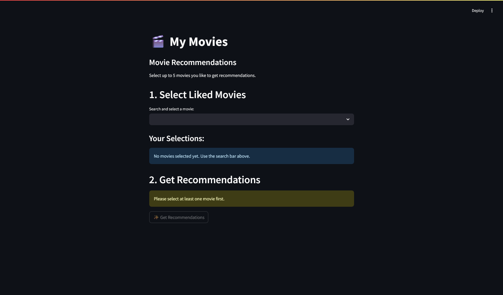

# 🎬 Movie Recommendation System 🍿

[](https://www.python.org/downloads/)
[](https://github.com/astral-sh/uv)
[](https://github.com/astral-sh/ruff)
[](https://streamlit.io/)

A simple Streamlit app that recommends movies based on your initial selections! Uses content-based filtering.

Dataset extracted from [Kaggle](https://www.kaggle.com/datasets/rounakbanik/the-movies-dataset)



## ✨ Features

*   Select up to 5 movies you like via search.
*   Get personalized recommendations based on movie content (genres, runtime, language).
*   Simple and clean Streamlit interface.
*   Uses `uv` for fast dependency management.
        
## 🚀 Getting Started

**1. Clone the Repository** 💾

```bash
git clone https://github.com/PedroG022/recommendation-system
cd recommendation-system
```

**2. Set up Virtual Environment & Install Dependencies (using uv)** 💨

*Make sure `uv` is installed (`pip install uv` or `pipx install uv`).*

```bash
uv sync
```

**3. Activate Virtual Environment** ✅

Choose the command for your shell:

*   **Bash/Zsh:** `source .venv/bin/activate`
*   **Fish:** `source .venv/bin/activate.fish`
*   **Cmd (Windows):** `.venv\Scripts\activate.bat`
*   **PowerShell (Windows):** `.venv\Scripts\Activate.ps1`

**4. Run the App!** ▶️

```bash
recommendation-system
```

---

Enjoy finding your next favorite movie! 🎉
